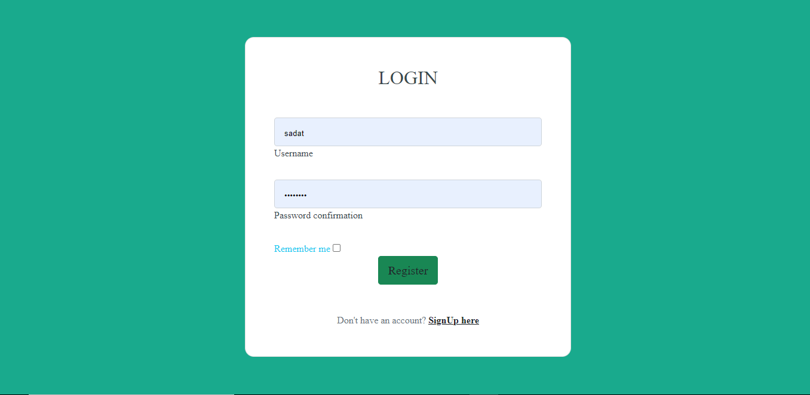

# A Login System with a User Profile Form

This project uses django's built-in UserCreationForm and AuthenticationForm to create a login and sign-up page for the users of the website to create an account, granting them access to the website.

## Login Page

## Sign-UP Page

## User Profile Page

## Profile Page

